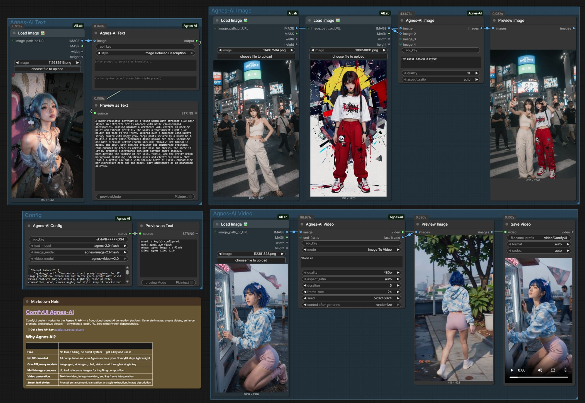

# ComfyUI Agnes-AI

ComfyUI custom nodes for the **Agnes AI API** — a free, cloud-based AI generation platform. Generate images, create videos, enhance prompts, and analyze visuals — all without a local GPU. Zero extra Python dependencies.



## Why Agnes AI?

| | |
|---|---|
| **Free** | No token billing, no credit system — get a key and use it |
| **No GPU needed** | All computation runs on Agnes servers, your ComfyUI stays lightweight |
| **One API, many models** | Image gen, video gen, chat, vision — all through a single key |
| **Multi-image compose** | Up to 4 reference images for img2img composition |
| **Video generation** | Text-to-video, image-to-video, and keyframe interpolation |
| **Smart text styles** | Prompt enhancement, translation, art style extraction, image description |

## Features

- **Image Generation** — Text2img / img2img with up to 4 reference images. Auto-detects mode based on input connections. 1K / 2K / 4K resolution.
- **Video Generation** — Text-to-video, image-to-video, first-and-last-frame keyframe animation. 480p / 720p / 1080p, 2–15 seconds, configurable frame rate.
- **Prompt Enhancement** — 4 built-in styles: enhance, translate, extract art style, describe image. Custom system prompt override. Vision-based styles with image input.
- **Config Node** — Save API keys (comma-separated for rotation), set default models, customize prompt styles via JSON.

## Installation

### Method 1: ComfyUI-Manager
Search `Agnes-AI` in ComfyUI-Manager and install.

### Method 2: Git Clone
```bash
cd ComfyUI/custom_nodes
git clone https://github.com/1038lab/ComfyUI-Agnes-AI
```
Restart ComfyUI.

### Method 3: Manual Install
Download the [latest release](https://github.com/1038lab/ComfyUI-Agnes-AI/releases), extract to `ComfyUI/custom_nodes/ComfyUI-Agnes-AI/`, restart ComfyUI.

No `pip install` needed — zero additional dependencies.

## API Key

> **Get a free API key:** [platform.agnes-ai.com](https://platform.agnes-ai.com)

Priority: **widget key** > **env var** (`AGNES_API_KEY`) > **saved config**.

Key is auto-saved to `agnes_config.json` on first use. Use **Agnes-ai Config** node to view or edit it anytime. Multiple keys can be comma-separated (round-robin rotation).

## Nodes

### 🖼️ Agnes-ai Image
Generate images from text, or compose new images from up to 4 reference images. Auto-detects text2img (no image input) vs img2img (images connected). When images are connected without a prompt, defaults to merging them into one cohesive composition. Supports 1K / 2K / 4K with various aspect ratios.

### 🎬 Agnes-ai Video
Three modes:
- **Text To Video** — generate video from text
- **Image To Video** — animate from a start frame
- **First and Last frame** — interpolate between two images

Supports 480p / 720p / 1080p, 2–15 seconds, configurable frame rate. Last frame is automatically extracted and available as a separate IMAGE output.

### ✏️ Agnes-ai Text
Process prompts through 4 built-in styles:

| Style | Needs Image | Use Case |
|-------|-------------|----------|
| Prompt Enhance | No | Expand brief prompts with vivid visual context |
| Translate to English | No | Translate prompts while preserving visual details |
| Extract Art Style from Image | Yes | Analyze artistic style from a reference image |
| Image Detailed Description | Yes | Generate detailed AI-ready prompts from images |

Custom system prompt override supported for all styles.

### ⚙️ Agnes-ai Config
Save API keys (comma-separated for round-robin rotation), select default models for each node, and customize prompt styles via JSON. All values persist across restarts. Key display is masked (`sk-****abcd`).

## Example Workflows

_Coming soon — check the [example_workflows](./example_workflows) directory._

## Credits

- **Agnes AI** — Free API and model infrastructure. Get your key at [platform.agnes-ai.com](https://platform.agnes-ai.com)
- Created by [AILab](https://github.com/1038lab)

## License

GPL-3.0

If this custom node helps you, please ⭐ the repo!
