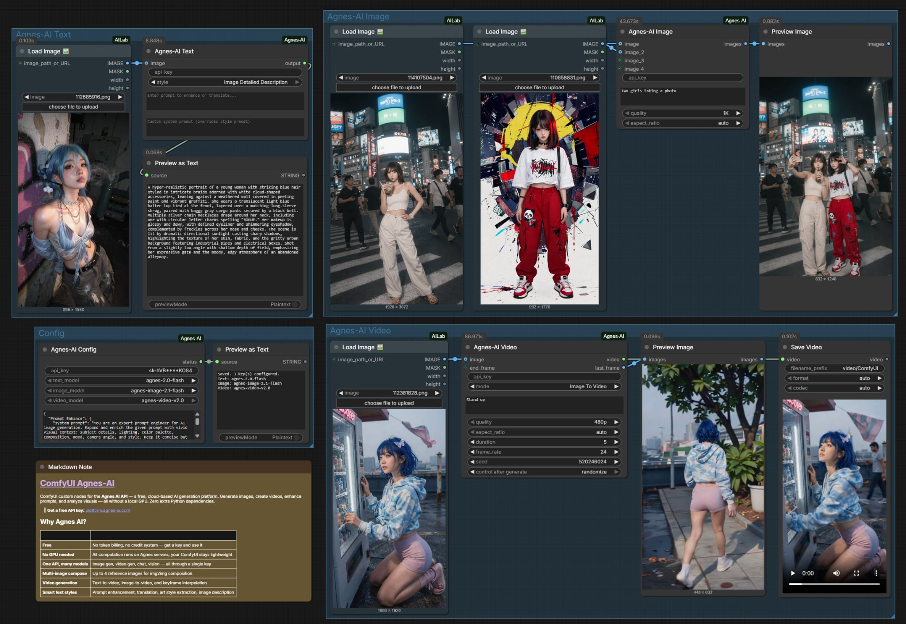

# ComfyUI Agnes-AI

[English](README.md) | [中文说明](README_zh.md)

ComfyUI custom nodes for the **Agnes AI API** — a free, cloud-based AI generation platform. Generate images, create videos, enhance prompts, and analyze visuals — all without a local GPU. Zero extra Python dependencies.



## News & Updates

- **2026/09/15**: Update ComfyUI-Agnes-AI to **v1.2.0** ( [updates.md](updates.md) )
  - Upgraded to next-gen Agnes AI models: `agnes-3.0-flash`, `agnes-image-2.5-flash`, and `agnes-video-2.5-flash`.
  - **Dynamic Input Slots**: Nodes start clean with a single input point (`image_0`, `ref_image_0`, `ref_audio_0`) and automatically add new slots as you connect wires.
  - **Zero Required Ports**: All media connection points are fully optional; text-to-image and text-to-video work with prompt alone.
  - **Comprehensive Video Resolutions**: Added `480P`, `720P`, `1080P`, `1K`, and `2K` options with automatic Flash 720P safeguard.
  - **Reference Video Support**: Added dedicated `ref_video` input for `agnes-video-2.5` standard model.
  - **Native Progress & Interruption**: Integrated ComfyUI real-time progress bar and instant cancellation.
- **2026/07/29**: Update ComfyUI-Agnes-AI to **v1.1.0** ( [updates.md](updates.md) )

### v1.0.0

Initial release with Agnes-AI Image, Video, Text, and Config nodes.

## Why Agnes AI?

| | |
|---|---|
| **Free** | No token billing, no credit system — get a key and use it |
| **No GPU needed** | All computation runs on Agnes servers, your ComfyUI stays lightweight |
| **One API, many models** | Image gen, video gen, chat, vision — all through a single key |
| **Dynamic Input Slots** | Clean initial nodes that automatically add slots as you connect wires |
| **Multi-modal Reference**| Up to 5 images, 3 audio tracks, and 1 video reference for video generation |
| **Smart text presets** | Prompt enhancement, translation, art style extraction, image description |

> **Get a free API key:** [platform.agnes-ai.com](https://platform.agnes-ai.com)

## Features

- **Image Generation** (`agnes-image-2.5-flash`) — Text2img / img2img with ComfyUI 3.0 Autogrow reference images (starts with `image_0`, up to 4 images). Auto-detects mode based on inputs. 1K / 2K / 3K / 4K resolution.
- **Video Generation** (`agnes-video-2.5-flash` / `agnes-video-2.5`) — Text-to-video, image-to-video, first-and-last-frame animation, and multimodal reference (up to 5 images, 3 audios, 1 video). 480P–2K resolution tiers with Flash auto-safeguard, real-time progress bar, and frame/audio extraction.
- **Prompt Enhancement** (`agnes-3.0-flash`) — 4 built-in presets: enhance, translate, extract art style, describe image. 512K context with multimodal support.
- **Settings Panel** — Configure API key, select default models, all from ComfyUI's built-in Settings Panel. Supports multiple backup keys with automatic failover.

## Installation

### Method 1: ComfyUI-Manager
Search `Agnes-AI` in ComfyUI-Manager and install.

### Method 2: Git Clone
```bash
cd ComfyUI/custom_nodes
git clone https://github.com/1038lab/ComfyUI-Agnes-AI
```
Restart ComfyUI.

### Method 3: Manual Install
Download the [latest release](https://github.com/1038lab/ComfyUI-Agnes-AI/releases), extract to `ComfyUI/custom_nodes/ComfyUI-Agnes-AI/`, restart ComfyUI.

No `pip install` needed — zero additional dependencies.

## API Key Setup

Open ComfyUI **Settings** (⚙️ gear icon) → search **"Agnes-AI"** → enter your API key.

- Supports multiple backup keys (one per line or comma-separated) with **automatic failover**
tomatic failover**
- Alternatively, set the `AGNES_API_KEY` environment variable
- Key is saved to `agnes_config.json` and persists across restarts

Priority: **env var** (`AGNES_API_KEY`) > **saved config** (Settings Panel).

## Nodes

### 🖼️ Agnes-AI Image
Generate images from text, or compose new images from up to 4 reference images with `agnes-image-2.5-flash`.
- Starts cleanly showing only **`image_0`**; automatically adds next slots as images are connected.
- Auto-detects text2img (no images connected) vs img2img (images connected).
- When images are connected without a text prompt, automatically defaults to merging them into a cohesive composition.
- Supports 1K / 2K / 3K / 4K with configurable aspect ratios. All connection points are optional.

### 🎬 Agnes-AI Video
Powered by `agnes-video-2.5-flash` (and `agnes-video-2.5` / `agnes-video-v2.0`). Four generation modes:
- **Text To Video** — generate video purely from prompt (no inputs required)
- **Image To Video** — animate starting from `first_image`
- **First and Last frame** — interpolate smoothly between `first_image` and `end_frame`
- **Reference (Images/Audio/Video)** — generate video using multi-image, audio, and video reference materials

**Inputs (All Connection Points Optional):**
- **mode** — `Text To Video`, `Image To Video`, `First and Last frame`, `Reference (Images/Audio/Video)`.
- **prompt** — Description of the video to generate.
- **quality** — `480P`, `720P`, `1080P`, `1K`, `2K`. (Note: Flash model automatically downgrades to 720P per official specification).
- **aspect_ratio** — `auto`, `16:9`, `9:16`, `1:1`, `4:3`, `3:4`, `21:9`.
- **duration** (4–12s), **seed**.
- **first_image** — Start frame or primary reference image.
- **end_frame** — End frame for keyframe mode.
- **ref_image_0** — Reference image slot (Autogrow: starts with `ref_image_0`, expands up to 5 images as connected).
- **ref_audio_0** — Reference audio track slot (Autogrow: starts with `ref_audio_0`, expands up to 3 tracks as connected).
- **ref_video** — Reference video input (supported on standard `agnes-video-2.5`).

**Outputs:**
- **video** — Generated video file path.
- **last_frame** — Automatically extracted last frame of the video (`IMAGE`).
- **frames** — Full sequence of extracted video frames as a batched `IMAGE` tensor (requires local `ffmpeg`).
- **audio** — Extracted audio track as a standard ComfyUI `AUDIO` waveform (requires local `ffmpeg`).

### ✏️ Agnes-AI Text
Powered by `agnes-3.0-flash`. Process prompts through 8 built-in production presets:

| Preset | Needs Image | Use Case |
|--------|:-----------:|----------|
| **Prompt Enhance** | No | Expand brief prompts with vivid visual context |
| **Translate to English** | No | Translate prompts while preserving visual details |
| **Script Writing** | No | Structured short film/video scripts (3–5 scenes) with dialogue & action |
| **Storyboard Creation** | No | Cinematic shot breakdown with shot sizes, camera motion, framing & audio |
| **Image Detailed Description** | Yes | Generate detailed AI-ready prompts from images |
| **Image Analysis** | Yes | Structured 6-dimension visual critique, quality score & suggestions |
| **Extract Art Style from Image** | Yes | Analyze artistic style from a reference image |
| **Image Edit Prompt** | No (Optional) | Modular edit analysis producing unified prompts for diffusion edit models |

**Extensible Presets:**
All presets are externalized in `presets/styles.json`. You can customize them or drop any `.json` / `.md` preset files into the `presets/` folder for automatic loading. Custom system prompt overrides are also supported on the node.

## Example Workflows

Ready-to-use workflows are available in the [example_workflows](./example_workflows) directory:
- **`01_Text_to_Image_and_Fusion.json`** — Text-to-image generation and multi-image fusion with `Agnes-AI Image`.
- **`02_Text_and_Image_to_Video.json`** — Text-to-video and start-frame keyframe animation with `Agnes-AI Video`.
- **`03_Prompt_Enhance_and_Vision.json`** — Prompt expansion and image reverse-prompt description with `Agnes-AI Text`.

Simply drag and drop any of these `.json` files into ComfyUI to get started immediately!

## Credits

- **Agnes AI** — Free API and model infrastructure. Get your key at [platform.agnes-ai.com](https://platform.agnes-ai.com)
- Created by [AILab](https://github.com/1038lab)

## License

GPL-3.0

If this custom node helps you, please ⭐ the repo!
