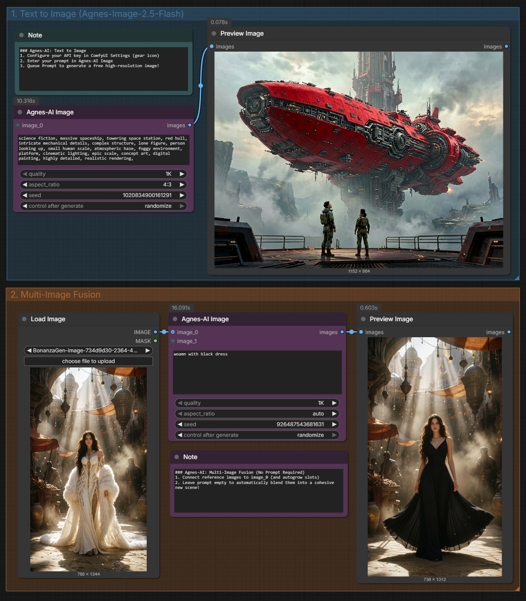
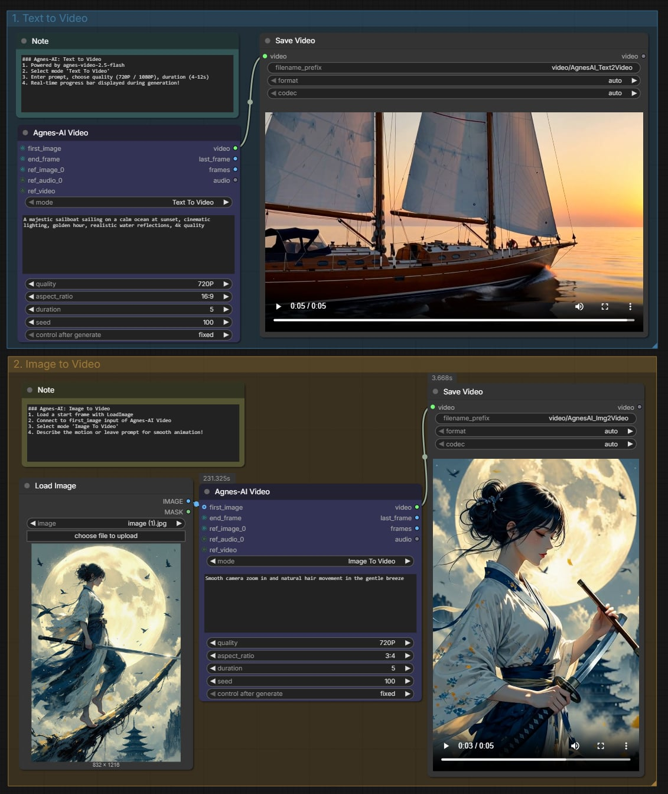
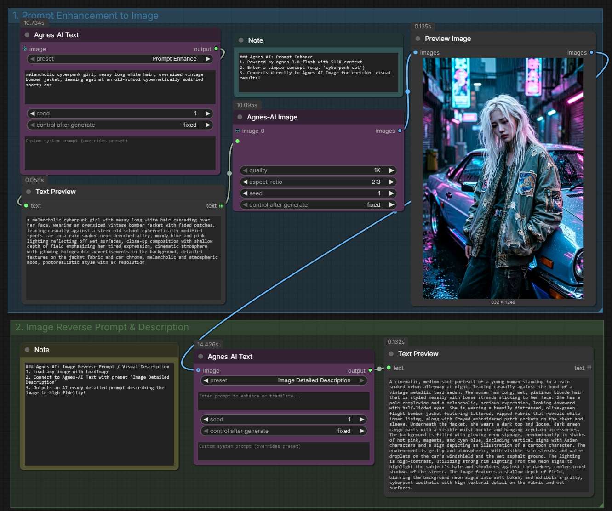

# ComfyUI Agnes-AI

[English](README.md) | [中文说明](README_zh.md)

ComfyUI 专用的 **Agnes AI API** 自定义节点插件 —— 免费、免本地显卡云端 AI 生成平台。直接在 ComfyUI 中一键生成高质量图片、创作视频、智能扩写提示词以及进行图像视觉反推。无需昂贵的高性能本地 GPU，且零额外 Python 依赖！


## 最新动态与更新

- **2026/09/17**: 更新至 **v1.2.1**（详见 [更新日志 updates.md](updates.md)）
  - 默认开启 HTTPS 证书校验；优化设置面板 API Key 管理，防止误覆盖。
- **2026/09/16**: 更新至 **v1.2.0**（详见 [更新日志 updates.md](updates.md)）
  - 全面升级至 Agnes AI 新一代旗舰模型：`agnes-3.0-flash`、`agnes-image-2.5-flash` 与 `agnes-video-2.5-flash`。
  - **动态端口生长（ComfyUI 3.0）**：节点初始保持清爽的单端口（`image_0`、`ref_image_0`、`ref_audio_0`），连线后自动新增后续插槽。
  - **连接点全可选（零必填端口）**：所有媒体输入均为可选连接点；文生图、文生视频在无任何连线时输入提示词即可直接生成。
  - **全档位视频分辨率**：开放 `480P`、`720P`、`1080P`、`1K`、`2K` 分辨率，并在选择 Flash 模型时自动智能降级保护为 720P，杜绝 API 400 错误。
  - **新增参考视频支持**：增加独立 `ref_video` 端口，支持标准模型基于视频参考生成。
  - **原生进度条与中断取消**：集成 ComfyUI 实时 0~100% 进度条，点击中断立即取消云端轮询。

---

## 为什么选择 Agnes AI？

| 核心特性 | 说明 |
| :--- | :--- |
| **完全免费** | 零 Token 计费，无点数限制，获取 API Key 即可自由使用 |
| **无需本地显卡** | 运算全部运行在云端服务器，低配轻薄本或老旧电脑亦可流畅出图出视频 |
| **全模态聚合** | 一个 API Key 即可通行文生图、图生图、文生视频、图生视频、大模型对话与反推 |
| **动态输入端口** | 节点初始小巧美观，插上线自动扩展新槽位，告别满屏闲置端口的杂乱感 |
| **多模态丰富参考** | 视频支持首尾帧、最多 5 张图片、3 首音频和 1 个参考视频混合引导生成 |
| **多 Key 容灾备用** | 支持配置备用 API Key，在网络波动或配额受限时自动故障转移 |

> 🔑 **获取免费 API Key：** [platform.agnes-ai.com](https://platform.agnes-ai.com)

---

## 功能特性一览

- **图像生成 (`Agnes-AI Image`)**：基于 `agnes-image-2.5-flash`。支持文生图与图生图自适应切换。支持单图或最多 4 张参考图动态融合。支持 1K / 2K / 3K / 4K 高画质。
- **视频生成 (`Agnes-AI Video`)**：基于 `agnes-video-2.5-flash` / `agnes-video-2.5`。提供文生视频、图生视频、首尾帧过渡和全能多模态参考。支持 480P~2K 分辨率、4~12 秒时长调节、实时进度条及本地音视频轨道自动拆解提取。
- **提示词处理与视觉反推 (`Agnes-AI Text`)**：基于 `agnes-3.0-flash`。内置 4 大实用预设：提示词智能扩写、高质量英语翻译、提取艺术风格、图像详细描述（反推提示词）。512K 超大上下文多模态支持。
- **全局设置面板**：在 ComfyUI 原生设置面板（⚙️ 图标）统一配置 Key 与默认模型，全工作流通用且配置自动持久化保存。

---

## 安装方法

### 方法一：通过 ComfyUI-Manager 安装（推荐）
在 ComfyUI-Manager 搜索 `Agnes-AI`，点击 Install 安装并重启 ComfyUI。

### 方法二：通过 Git 克隆
```bash
cd ComfyUI/custom_nodes
git clone https://github.com/1038lab/ComfyUI-Agnes-AI
```
重启 ComfyUI 即可。

### 方法三：手动下载安装
在 GitHub 页面下载最新版本的 Release 压缩包，解压到 `ComfyUI/custom_nodes/ComfyUI-Agnes-AI/` 目录中，重启 ComfyUI。

> 本插件使用 Python 标准库构建，**无需额外运行 `pip install` 安装依赖**。

---

## API Key 配置指南

点击 ComfyUI 界面右上角或左侧的 **设置**（⚙️ 齿轮图标）→ 搜索 **"Agnes-AI"** → 填入你的 API Key。

- **多 Key 备用与容灾**：支持配置多个 API Key（换行或逗号分隔），当主 Key 遇到网络波动或临时不可用时自动切换到备用 Key，保障长时间生成任务不中断。
- **环境变量支持**：也可以直接在系统环境变量中设置 `AGNES_API_KEY`。
- **保存与持久化**：设置完成后自动保存到 `agnes_config.json`，重启 ComfyUI 不会丢失。

---

## 节点详细使用指南

### 🖼️ Agnes-AI Image (图片生成与融合)
负责文本生成图片，或者基于参考图片进行风格变换与多图融合：
- 节点初始仅显示 **`image_0`** 端口；连接图片后，前端会自动延伸出下一个端口，最多支持 4 张参考图。
- **智能自适应模式**：不接图片即为纯文生图；连入图片后自动切换为图生图。
- **免提示词图片融合**：当连入图片但留空 `prompt` 输入框时，节点会自动识别意图并将多张图片融合成一幅风格和谐的新画面。
- **分辨率与比例**：支持 1K / 2K / 3K / 4K，以及 11 种常见画面比例。所有媒体连接点均为可选。

### 🎬 Agnes-AI Video (视频创作)
负责视频的生成与多模态控制，提供 4 种生成模式：
- **Text To Video** — 纯文本描述生成视频（无需连接任何图片）。
- **Image To Video** — 从首帧图（`first_image`）出发赋予动态。
- **First and Last frame** — 首尾关键帧过渡动画（连接 `first_image` 与 `end_frame`）。
- **Reference (Images/Audio/Video)** — 多模态素材参考生成：
  - `ref_image_0`：参考图片端口（动态生长，最多 5 张）。
  - `ref_audio_0`：参考音频轨道端口（动态生长，最多 3 首）。
  - `ref_video`：参考视频端口（支持标准模型）。

**输入参数说明（所有连接点均为可选）：**
- **mode**：生成模式切换。
- **prompt**：视频动作与运镜描述提示词。
- **quality**：可选 `480P`、`720P`、`1080P`、`1K`、`2K`（注：Flash 官方协议限定 720P，选择 Flash 模型时会自动进行 720P 智能兼容降级）。
- **duration**：4~12 秒；**aspect_ratio**：画面比例。

**输出结果：**
- **video**：生成的视频文件。
- **last_frame**：自动提取出的视频最后一帧画面（`IMAGE`），方便直连下一段视频进行无限接力续写。
- **frames**：完整视频逐帧序列（`IMAGE`，需本地配置好 ffmpeg）。
- **audio**：提取出的视频音频轨道（`AUDIO`，需本地配置好 ffmpeg）。

### ✏️ Agnes-AI Text (提示词助手与视觉反推)
内置 8 种面向生图/生视频/剧本制作的高频场景预设：

| 预设模式 | 是否需连图片 | 核心用途 |
| :--- | :---: | :--- |
| **Prompt Enhance** (提示词增强) | 否 | 将简短想法扩写为包含光影、构图与细节的专业级生图提示词 |
| **Translate to English** (翻译为英文) | 否 | 保持视觉细节与艺术术语准确性的专业英文翻译 |
| **Script Writing** (影视剧本创作) | 否 | 生成 3-5 场戏标准短片剧本，包含场景、角色对白、镜头动作与情绪提示 |
| **Storyboard Creation** (分镜脚本制作) | 否 | 工业级分镜脚本拆解，标注标准景别（ELS~ECU）、运镜方式、画面构图与台词 |
| **Image Detailed Description** (图像反推) | 是 | 详细反推图片全部细节，生成可复刻同款画面的高质量提示词 |
| **Image Analysis** (图像深度分析) | 是 | 6 维深度视觉诊断（主体、色彩、光影、构图、风格、画质评估评分与建议） |
| **Extract Art Style from Image** (风格提取) | 是 | 深度分析参考图的艺术流派、笔触、配色与光影方案 |
| **Image Edit Prompt** (图像编辑提示词) | 否（可选连图） | 分析重绘需求与原图要素，生成模块化修改要点及适配生图模型的英文提示词 |

> **提示词外置与自定义**：所有预设均独立保存在 `presets/styles.json` 中。支持直接编辑修改，也可将自定义的 `.json` 或 `.md` 提示词文件直接放入 `presets/` 目录，插件将在启动时自动发现并加载！节点上亦支持通过 `system_prompt` 输入端进行实时单次覆盖。

---

## 画质与分辨率参考对照表

### 图片分辨率 (Agnes-AI Image)
| 比例 | 1K | 2K | 3K | 4K |
| :---: | :---: | :---: | :---: | :---: |
| **1:1** | 1024×1024 | 2048×2048 | 3072×3072 | 4096×4096 |
| **16:9** | 1816×1024 | 3640×2048 | 5456×3072 | 7280×4096 |
| **9:16** | 1024×1816 | 2048×3640 | 3072×5456 | 4096×7280 |
| **4:3** | 1360×1024 | 2728×2048 | 4096×3072 | 5456×4096 |
| **3:4** | 1024×1360 | 2048×2728 | 3072×4096 | 4096×5456 |
| **21:9** | 2384×1024 | 4776×2048 | 7168×3072 | 9552×4096 |

### 视频分辨率 (Agnes-AI Video)
| 比例 | 480P | 720P (Flash推荐) | 1080P |
| :---: | :---: | :---: | :---: |
| **16:9** | 854×480 | 1280×720 | 1920×1080 |
| **9:16** | 480×854 | 720×1280 | 1080×1920 |
| **1:1** | 480×480 | 720×720 | 1080×1080 |

---

## 示例工作流 (即拖即跑)

在插件的 [example_workflows](./example_workflows) 目录中提供了经过全面测试的标准工作流：

- **[01_Text_to_Image_and_Fusion.json](https://github.com/1038lab/ComfyUI-Agnes-AI/blob/main/example_workflows/01_Text_to_Image_and_Fusion.json)**：高质量文生图与双图免提示词场景融合工作流。
 
 
- **[02_Text_and_Image_to_Video.json](https://github.com/1038lab/ComfyUI-Agnes-AI/blob/main/example_workflows/02_Text_and_Image_to_Video.json)**：文生视频与首帧动画图生视频工作流。
 
 
- **[03_Prompt_Enhance_and_Vision.json](https://github.com/1038lab/ComfyUI-Agnes-AI/blob/main/example_workflows/03_Prompt_Enhance_and_Vision.json)**：提示词智能扩写与图片反推提示词工作流。
 

> **使用方法**：直接将任意 `.json` 文件拖入你的 ComfyUI 浏览器窗口即可自动加载运行！

---

## 常见问题解答 (FAQ)

**Q1：生成视频时提示等待时间较长？**
> 视频模型为云端异步渲染生成，一般需要 1~3 分钟。生成期间 ComfyUI 底部会显示真实进度条（0~100%）。如遇云端高峰期可能进入排队状态，耐心等待即可。

**Q2：选择 1080P 生成 Flash 视频，为什么后台日志提示降级到 720P？**
> 官方 API 规范对 Flash 视频模型有限定（最高支持 720P）。为了避免直接向你弹出 API 400 错误导致工作流中断，插件会在后台自动将其平滑调整为 720P 保证顺利出片。若需 1080P 及以上视频，可在设置中选用标准版 `agnes-video-2.5` 模型。

**Q3：提示词反推出来的文本怎么直接给其他生图模型用？**
> 将 `Agnes-AI Text` 节点的 `output` 字符串输出端，直接连入 `CLIP Text Encode`（或任意生图节点的文本输入）即可。

---

## 鸣谢与许可

- **Agnes AI** — 免费 API 与模型云端支持：[platform.agnes-ai.com](https://platform.agnes-ai.com)
- 开发者：[AILab](https://github.com/1038lab)
- 开源协议：GPL-3.0

如果这个项目对你的创作有所帮助，欢迎在 GitHub 上给我们点亮一颗 ⭐ **Star** 支持一下！