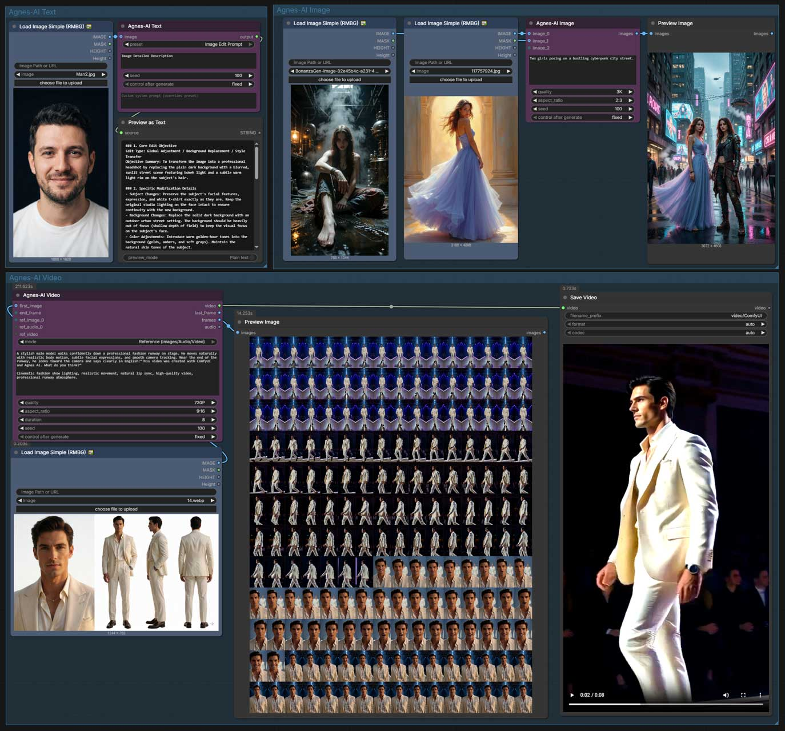

# ComfyUI-Agnes-AI Update Log

## V1.2.0 (2026/09/16)

**Next-Gen Models, Dynamic Slots & External Preset System** — Major architectural upgrade introducing Agnes AI's next-generation models, auto-growing connection points, decoupled prompt presets, and production-grade creative assistants:
- **New (External Preset Architecture):** Extracted prompt styles from Python source code into `presets/styles.json`. Users can easily customize prompts, back up presets, or drop custom `.json` / `.md` files into `presets/` for automatic discovery.
- **New (4 Production-Grade Creative Assistants):** Expanded Text node from 4 to 8 presets:
  - `Image Analysis`: Comprehensive 6-dimension visual evaluation (Subject & Background, Palette & Tone, Lighting & Texture, Composition, Mood & Style, Technical Quality) with scoring and recommendations.
  - `Script Writing`: Fast-paced, structured short film/video scripts (3–5 scenes) with scene settings, character profiles, authentic dialogue, action lines, and tension pacing.
  - `Storyboard Creation`: Cinematic storyboard breakdowns with standard shot sizes (ELS to ECU), camera movements (Pan, Tilt, Dolly, Crane, Orbit), visual framing, and audio/dialogue cues.
  - `Image Edit Prompt`: Precision prompt generation for img2img, inpainting, and style transfer models with modular breakdowns and final unified English diffusion prompts.
- **New (Dynamic Input Slots):** Added auto-growing connection points for image and video nodes. Nodes start clean with a single input point and automatically add new slots as you connect wires:
  - **Image Node:** Starts cleanly with `image_0`, automatically expands up to 4 reference images as connected.
  - **Video Node:** Starts cleanly with `ref_image_0` (up to 5 images) and `ref_audio_0` (up to 3 audio tracks).
- **New (Reference Video):** Added a dedicated `ref_video` input slot on the Video node for video reference generation (supported on standard models).
- **New (Full Resolution Tiers):** Added comprehensive video resolution choices: `480P`, `720P`, `1080P`, `1K`, and `2K`.
- **New (Native Progress Bar):** Added real-time 0–100% progress tracking bar in ComfyUI during video generation.
- **New (Instant Cancellation):** Interrupting a running prompt now immediately stops cloud video polling.
- **New (Next-Gen Models):**
  - **Text:** Upgraded to `agnes-3.0-flash` with 512K context window and agent-level reasoning.
  - **Image:** Upgraded to `agnes-image-2.5-flash` with a new **3K** resolution tier.
  - **Video:** Upgraded to `agnes-video-2.5-flash` with 4 operating modes (`Text To Video`, `Image To Video`, `First and Last frame`, and `Reference (Images/Audio/Video)`).
- **Improved (Smart Multimodal Text Node):** Connecting an image now respects and preserves user text input rather than overwriting it, and non-image presets seamlessly support optional image reference inputs.
- **Improved (Unified Prompt Engineering Standards):** All 8 presets refactored to conform to high-performance LLM prompt standards with unified structure, zero bloat, and context-aware default fallback prompts.
- **Improved (Zero Required Ports):** All media connection points on image and video nodes are completely optional. Text-to-image and text-to-video work seamlessly with text prompts alone without requiring any connected inputs.
- **Improved (Smart Flash Safeguard):** When using Flash video models, any non-720P resolution automatically adjusts to 720P in the background, preventing API errors without needing manual reconfiguration.
- **Improved (Prompt-Free Image Merge):** Connecting images to the Image node without entering a text prompt now automatically merges the images into a cohesive composition.
- **Fixed:** Resolved prompt validation errors that previously blocked workflow execution when audio or image inputs were left unconnected.
- **Fixed:** Resolved an execution failure when running on modern ComfyUI versions.

## V1.1.0 (2026/07/29)  
**Settings Panel Integration** — Configuration moved from node to ComfyUI Settings Panel.

- **New:** Integrated Agnes-AI settings directly into the ComfyUI Settings Panel (⚙️) to configure the API key and select default models for text, image, and video generation.
- **New:** Added support for `agnes-2.5-flash` and `agnes-2.5-pro-alpha` text models.
- **Improved:** Set `agnes-2.5-flash` as default text model (`agnes-2.5-pro-alpha` is available as a paid model option).
- **New:** Added negative prompt support on the Video node to easily exclude specific elements from generated videos.
- **New:** Added direct frame sequence extraction and audio track extraction outputs on the Video node (requires local `ffmpeg`).
- **New:** Integrated automated script loading to support ComfyUI's modern custom extension interface.
- **Improved:** Consolidated the API key configuration and the "Get API key" link into a single settings entry.
- **Improved:** Widened settings panel input fields so that long model names and API keys are fully visible.
- **Improved:** Made the API key global so it is set once in Settings and automatically used across all nodes.
- **Improved:** Renamed the Text node's "style" option to "preset" for better clarity and ease of use.
- **Improved:** Updated duration constraints for the Video node (extended from 2–15s to 3–18s).
- **Fixed:** Corrected image merging payload format to resolve 400 errors during image-to-image generation.
- **Fixed:** Resolved a crash that occurred when generating text-to-image variations if the server returned empty data.
- **Fixed:** Corrected image-to-image data encoding to match server format requirements.
- **Backend:** Added server communication handlers to cleanly read and write options from the Settings Panel.

## v1.0.0

Initial release with Agnes-AI Image, Video, Text, and Config nodes.
